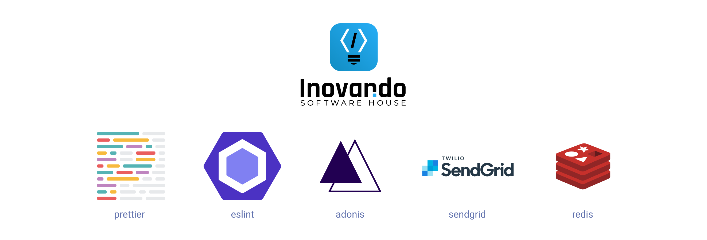
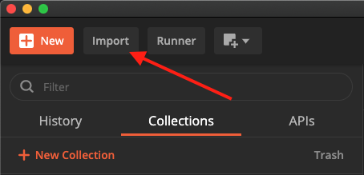
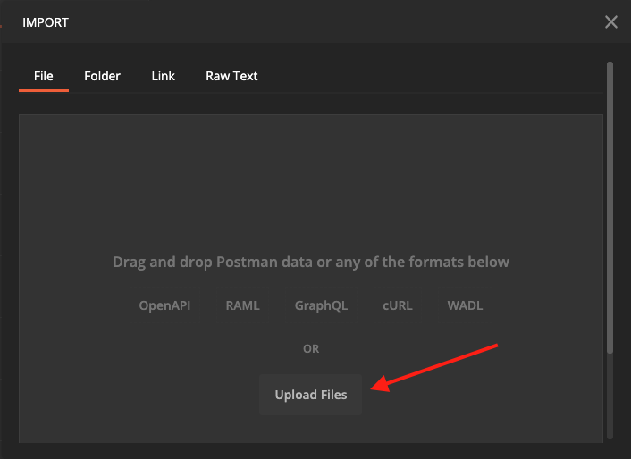
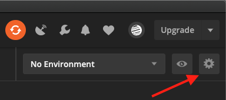
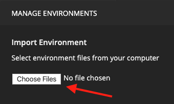

# Adonis API application
> 🔺 Inovando's template for adonis

[](https://github.com/prettier/prettier)
[](http://commitizen.github.io/cz-cli/)



## Usage

1. Setup a [PostgreSQL](#postgresql)

2. Modify `.env` fulfilling variables as needed

3. Initialize your project with this command:

```bash
adonis new yardstick --blueprint=inovando/adonis-api-app
adonis migration:refresh --seed
```

4. Run the following command:

```bash
adonis serve --dev
```

5. Done 🎉

### PostgreSQL

#### Local install

[Follow this link](https://www.postgresql.org/download/)

#### Docker

```bash
docker run --name some-postgres -e POSTGRES_PASSWORD=mysecretpassword -p 5432:5432 -d postgres

```

### Migrations

Run the following command to run startup migrations.

```js
adonis migration:run
```

### Seeds

Run the following command to run recreate the database and seed.

```js
adonis migration:refresh --seed
```

### Postman

1. Download [Postman](https://www.postman.com/downloads/)

3. Import our [Postman Collection](https://learning.postman.com/docs/postman/collections/intro-to-collections/) from `postman/Template Adonis.postman_collection.json`




4. Import our [Postman Environment](https://learning.postman.com/docs/postman/variables-and-environments/managing-environments/) from `postman/Template Adonis.postman_environment.json`





### Features

- [x] Bodyparser
- [x] Authentication
- [x] CORS
- [x] Lucid ORM
- [x] Migrations and seeds
- [x] Abstração Controller/Repository
- [x] [Bumblebee (include)](https://github.com/rhwilr/adonis-bumblebee)
- [x] Enviar e-mails
- [x] Método para autenticar, resetar senha
- [x] Endpoints `/me`
- [x] Abstração de profiles
- [x] Upload de arquivos genérico
- [x] Sentry
- [x] Redis Cache
- [x] User and Profile Seeder
- [x] Commitizen Friendly

